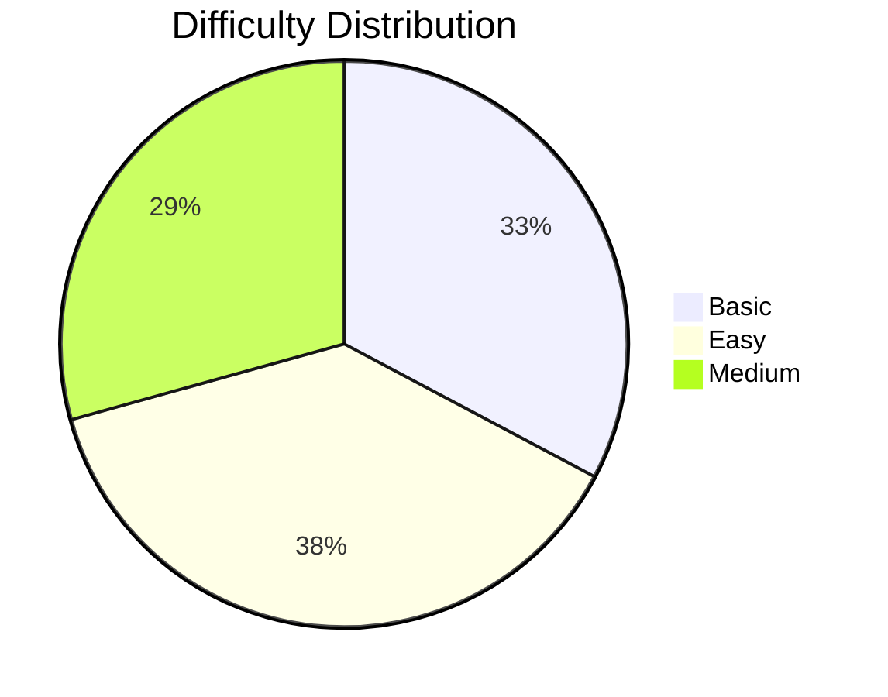

# 📊 1-Math_GFG - GeeksforGeeks Progress Tracker

---

## 📑 Table of Contents

1. [📈 Progress Statistics](#-progress-statistics)
2. [🏷️ Top Topics by Question Frequency](#️-top-topics-by-question-frequency)
3. [🏢 Companies](#-companies)
4. [📋 Problems List](#-problems-list)

## 📈 Progress Statistics

| Difficulty | Total | Solved | Remaining | Progress |
|------------|-------|--------|-----------|----------|
| ⚪ **Basic** | `19` | `0` | `19` |  |
| 🟢 **Easy** | `22` | `0` | `22` |  |
| 🟡 **Medium** | `17` | `0` | `17` |  |

## 🏷️ Top Topics by Question Frequency

| Rank | Topic | Questions | Percentage |
|------|-------|-----------|------------|
| 1 | **Algorithms** | `47` | `81.0%` |
| 2 | **Mathematical** | `45` | `77.6%` |
| 3 | **Data Structures** | `10` | `17.2%` |
| 4 | **number-theory** | `5` | `8.6%` |
| 5 | **Dynamic Programming** | `4` | `6.9%` |
| 6 | **Bit Magic** | `3` | `5.2%` |
| 7 | **Prime Number** | `3` | `5.2%` |
| 8 | **permutation** | `3` | `5.2%` |
| 9 | **Recursion** | `3` | `5.2%` |
| 10 | **sieve** | `3` | `5.2%` |
| 11 | **Matrix** | `2` | `3.4%` |
| 12 | **Geometric** | `2` | `3.4%` |
| 13 | **Searching** | `2` | `3.4%` |
| 14 | **Binary Search** | `2` | `3.4%` |
| 15 | **Arrays** | `2` | `3.4%` |

## 🏢 Companies

| Rank | Company | Questions | Percentage |
|------|---------|-----------|------------|
| 1 | **Microsoft** | `11` | `19.0%` |
| 2 | **Amazon** | `10` | `17.2%` |
| 3 | **MAQ Software** | `5` | `8.6%` |
| 4 | **Adobe** | `5` | `8.6%` |
| 5 | **Samsung** | `4` | `6.9%` |
| 6 | **VMWare** | `4` | `6.9%` |
| 7 | **Flipkart** | `4` | `6.9%` |
| 8 | **SAP Labs** | `3` | `5.2%` |
| 9 | **Zoho** | `3` | `5.2%` |
| 10 | **Snapdeal** | `3` | `5.2%` |

## 📋 Problems List

| # | Problem | Difficulty | Accuracy | Topics | Status |
|---|---------|------------|----------|--------|--------|
| 1 | [Series AP](../Problems/1-Math/GFG/Basic/703967_Series_AP.md) | ⚪ **Basic** | `59.24%` | Mathematical, series, Algorithms | ⏳ |
| 2 | [The dice problem](../Problems/1-Math/GFG/Basic/704133_The_dice_problem.md) | ⚪ **Basic** | `73.72%` | Mathematical, Algorithms | ⏳ |
| 3 | [Closest Number](../Problems/1-Math/GFG/Basic/703961_Closest_Number.md) | ⚪ **Basic** | `15.77%` | Mathematical, Algorithms | ⏳ |
| 4 | [Swap two numbers](../Problems/1-Math/GFG/Basic/704620_Swap_two_numbers.md) | ⚪ **Basic** | `70.02%` | Mathematical, Algorithms | ⏳ |
| 5 | [Sum of Squares of First n Natural Numbers](../Problems/1-Math/GFG/Easy/887939_Sum_of_Squares_of_First_n_Natural_Numbers.md) | 🟢 **Easy** | `81.7%` |  | ⏳ |
| 6 | [Sum of Natural Numbers](../Problems/1-Math/GFG/Basic/702732_Sum_of_Natural_Numbers.md) | ⚪ **Basic** | `23.81%` | Mathematical | ⏳ |
| 7 | [Multiplication Table](../Problems/1-Math/GFG/Basic/704112_Multiplication_Table.md) | ⚪ **Basic** | `44.81%` | Mathematical, Algorithms | ⏳ |
| 8 | [Odd or Even](../Problems/1-Math/GFG/Basic/703724_Odd_or_Even.md) | ⚪ **Basic** | `60.6%` | Mathematical, Bit Magic, Data Structures... | ⏳ |
| 9 | [Squares in a Matrix](../Problems/1-Math/GFG/Basic/705080_Squares_in_a_Matrix.md) | ⚪ **Basic** | `34.59%` | Matrix, Data Structures, Algorithms | ⏳ |
| 10 | [Sum Of Digits](../Problems/1-Math/GFG/Easy/703905_Sum_Of_Digits.md) | 🟢 **Easy** | `67.08%` | number-theory | ⏳ |
| 11 | [Reverse digits](../Problems/1-Math/GFG/Basic/703932_Reverse_digits.md) | ⚪ **Basic** | `46.92%` | Mathematical, Algorithms | ⏳ |
| 12 | [Prime Number](../Problems/1-Math/GFG/Easy/703954_Prime_Number.md) | 🟢 **Easy** | `22.2%` | Mathematical, Prime Number, Algorithms | ⏳ |
| 13 | [Check for Power](../Problems/1-Math/GFG/Basic/703757_Check_for_Power.md) | ⚪ **Basic** | `34.59%` | Mathematical, Algorithms | ⏳ |
| 14 | [Distance between 2 points](../Problems/1-Math/GFG/Basic/703978_Distance_between_2_points.md) | ⚪ **Basic** | `49.98%` | Mathematical, Geometric, Algorithms | ⏳ |
| 15 | [Valid Triangle](../Problems/1-Math/GFG/Easy/888023_Valid_Triangle.md) | 🟢 **Easy** | `45.57%` |  | ⏳ |
| 16 | [Overlapping rectangles](../Problems/1-Math/GFG/Easy/705474_Overlapping_rectangles.md) | 🟢 **Easy** | `26.6%` | Mathematical, Geometric, Algorithms | ⏳ |
| 17 | [Factorial](../Problems/1-Math/GFG/Basic/703913_Factorial.md) | ⚪ **Basic** | `40.58%` | Mathematical, Algorithms | ⏳ |
| 18 | [Pair cube count](../Problems/1-Math/GFG/Easy/704497_Pair_cube_count.md) | 🟢 **Easy** | `30.87%` | Mathematical, Algorithms | ⏳ |
| 19 | [GCD of two numbers](../Problems/1-Math/GFG/Basic/703672_GCD_of_two_numbers.md) | ⚪ **Basic** | `51.03%` | Mathematical, Algorithms | ⏳ |
| 20 | [LCM of two numbers](../Problems/1-Math/GFG/Easy/897662_LCM_of_two_numbers.md) | 🟢 **Easy** | `71.3%` | Mathematical | ⏳ |
| 21 | [Perfect Numbers](../Problems/1-Math/GFG/Easy/704477_Perfect_Numbers.md) | 🟢 **Easy** | `17.21%` | Mathematical, Algorithms | ⏳ |
| 22 | [Add two fractions](../Problems/1-Math/GFG/Basic/700259_Add_two_fractions.md) | ⚪ **Basic** | `33.11%` | Mathematical, Algorithms | ⏳ |
| 23 | [Day of the week](../Problems/1-Math/GFG/Easy/704549_Day_of_the_week.md) | 🟢 **Easy** | `41.67%` | Mathematical, Algorithms | ⏳ |
| 24 | [Nth Fibonacci Number](../Problems/1-Math/GFG/Easy/703841_Nth_Fibonacci_Number.md) | 🟢 **Easy** | `22.3%` | Dynamic Programming, Mathematical, Fibonacci... | ⏳ |
| 25 | [Decimal to binary](../Problems/1-Math/GFG/Easy/701111_Decimal_to_binary.md) | 🟢 **Easy** | `55.75%` | Practice-Problems, Bit Magic, Data Structures | ⏳ |
| 26 | [Find n-th term of series 1, 3, 6, 10, 15, 21](../Problems/1-Math/GFG/Basic/703884_Find_n-th_term_of_series_1,_3,_6,_10,_15,_21.md) | ⚪ **Basic** | `60.58%` | Mathematical, Algorithms | ⏳ |
| 27 | [Armstrong Numbers](../Problems/1-Math/GFG/Easy/703783_Armstrong_Numbers.md) | 🟢 **Easy** | `49.88%` | Mathematical, Algorithms | ⏳ |
| 28 | [Palindrome](../Problems/1-Math/GFG/Easy/703915_Palindrome.md) | 🟢 **Easy** | `56.28%` | palindrome | ⏳ |
| 29 | [Repeated sum of digits](../Problems/1-Math/GFG/Basic/704424_Repeated_sum_of_digits.md) | ⚪ **Basic** | `53.83%` | number-theory, Mathematical, Algorithms | ⏳ |
| 30 | [Count Digits](../Problems/1-Math/GFG/Easy/705530_Count_Digits.md) | 🟢 **Easy** | `50.84%` | CPP, Java | ⏳ |
| 31 | [Nearest Perfect Square](../Problems/1-Math/GFG/Easy/704434_Nearest_Perfect_Square.md) | 🟢 **Easy** | `42.84%` | Mathematical, Numbers, Algorithms | ⏳ |
| 32 | [Maximum number of 2X2 squares](../Problems/1-Math/GFG/Easy/706369_Maximum_number_of_2X2_squares.md) | 🟢 **Easy** | `66.64%` | Mathematical, Algorithms | ⏳ |
| 33 | [Squares in  N*N Chessboard](../Problems/1-Math/GFG/Easy/704775_Squares_in__NN_Chessboard.md) | 🟢 **Easy** | `66.14%` | number-theory, Mathematical, permutation... | ⏳ |
| 34 | [Square Root](../Problems/1-Math/GFG/Easy/700226_Square_Root.md) | 🟢 **Easy** | `54.03%` | Searching, Mathematical, Binary Search... | ⏳ |
| 35 | [3 Divisors](../Problems/1-Math/GFG/Medium/703970_3_Divisors.md) | 🟡 **Medium** | `11.17%` | Mathematical, Algorithms | ⏳ |
| 36 | [Check if divisible by 4](../Problems/1-Math/GFG/Basic/702929_Check_if_divisible_by_4.md) | ⚪ **Basic** | `46.91%` | Strings, Mathematical, Data Structures... | ⏳ |
| 37 | [Divisible by 13](../Problems/1-Math/GFG/Medium/897411_Divisible_by_13.md) | 🟡 **Medium** | `50.24%` | Mathematical | ⏳ |
| 38 | [Print the Kth Digit](../Problems/1-Math/GFG/Basic/704564_Print_the_Kth_Digit.md) | ⚪ **Basic** | `38.65%` | Mathematical, Algorithms | ⏳ |
| 39 | [Fraction to Repeating Decimal](../Problems/1-Math/GFG/Medium/705108_Fraction_to_Repeating_Decimal.md) | 🟡 **Medium** | `23.12%` | Hash, Mathematical, Data Structures... | ⏳ |
| 40 | [nPr](../Problems/1-Math/GFG/Basic/705035_nPr.md) | ⚪ **Basic** | `35.25%` | Mathematical, permutation, Algorithms | ⏳ |
| 41 | [nCr](../Problems/1-Math/GFG/Medium/704542_nCr.md) | 🟡 **Medium** | `14.82%` | Dynamic Programming, Mathematical, Algorithms | ⏳ |
| 42 | [Pascal Triangle](../Problems/1-Math/GFG/Medium/702695_Pascal_Triangle.md) | 🟡 **Medium** | `23.68%` | Arrays, Recursion, Data Structures... | ⏳ |
| 43 | [All divisors of a Number](../Problems/1-Math/GFG/Easy/712172_All_divisors_of_a_Number.md) | 🟢 **Easy** | `46.73%` | Mathematical, Factorization, Algorithms | ⏳ |
| 44 | [Prime Factors](../Problems/1-Math/GFG/Easy/705041_Prime_Factors.md) | 🟢 **Easy** | `30.47%` | Mathematical, Prime Number, sieve... | ⏳ |
| 45 | [Largest prime factor](../Problems/1-Math/GFG/Medium/703958_Largest_prime_factor.md) | 🟡 **Medium** | `27.25%` | Mathematical, Prime Number, sieve... | ⏳ |
| 46 | [Modular Exponentiation](../Problems/1-Math/GFG/Medium/703909_Modular_Exponentiation.md) | 🟡 **Medium** | `52.56%` | Divide and Conquer, Binary Search, Algorithms... | ⏳ |
| 47 | [Nth Catalan Number](../Problems/1-Math/GFG/Medium/701751_Nth_Catalan_Number.md) | 🟡 **Medium** | `31.06%` | Dynamic Programming, Mathematical, Algorithms | ⏳ |
| 48 | [nCr](../Problems/1-Math/GFG/Medium/704542_nCr.md) | 🟡 **Medium** | `14.82%` | Dynamic Programming, Mathematical, Algorithms | ⏳ |
| 49 | [Power Set](../Problems/1-Math/GFG/Medium/704428_Power_Set.md) | 🟡 **Medium** | `43.3%` | Mathematical, Bit Magic, Data Structures... | ⏳ |
| 50 | [Next Permutation](../Problems/1-Math/GFG/Medium/705146_Next_Permutation.md) | 🟡 **Medium** | `40.66%` | Arrays, permutation, constructive algo... | ⏳ |
| 51 | [Power of k in factorial of n](../Problems/1-Math/GFG/Medium/705234_Power_of_k_in_factorial_of_n.md) | 🟡 **Medium** | `51.2%` | number-theory, Mathematical, Algorithms | ⏳ |
| 52 | [Determinant of a Matrix](../Problems/1-Math/GFG/Medium/701269_Determinant_of_a_Matrix.md) | 🟡 **Medium** | `56.66%` | Matrix, Data Structures | ⏳ |
| 53 | [Josephus problem](../Problems/1-Math/GFG/Easy/700361_Josephus_problem.md) | 🟢 **Easy** | `57.26%` | Recursion, Data Structures, Algorithms | ⏳ |
| 54 | [Euler Totient Function](../Problems/1-Math/GFG/Easy/704399_Euler_Totient_Function.md) | 🟢 **Easy** | `32.11%` | Mathematical, Algorithms | ⏳ |
| 55 | [Tower Of Hanoi](../Problems/1-Math/GFG/Medium/701190_Tower_Of_Hanoi.md) | 🟡 **Medium** | `35.23%` | Recursion, Algorithms | ⏳ |
| 56 | [Angle between hour and minute hand](../Problems/1-Math/GFG/Medium/703981_Angle_between_hour_and_minute_hand.md) | 🟡 **Medium** | `15.91%` | Mathematical, Algorithms | ⏳ |
| 57 | [Super Primes](../Problems/1-Math/GFG/Medium/702913_Super_Primes.md) | 🟡 **Medium** | `24.9%` | Searching, Algorithms | ⏳ |
| 58 | [Sieve of Eratosthenes](../Problems/1-Math/GFG/Medium/704146_Sieve_of_Eratosthenes.md) | 🟡 **Medium** | `47.43%` | Mathematical, sieve, Algorithms | ⏳ |

### 📝 Status Legend

| Symbol | Meaning |
|--------|----------|
| ⏳ | Not Started |
| 🎯 | Attempted |
| ✅ | Solved |
| 🔄 | Under Review |
| 🏆 | Mastered |

## 📊 Difficulty Distribution

---

*Generated on 17--09--2025 from `1-Math_GFG.json`*

**Happy Coding! 🚀 Learn from Mistakes! 📈 Keep Going! 💪**

