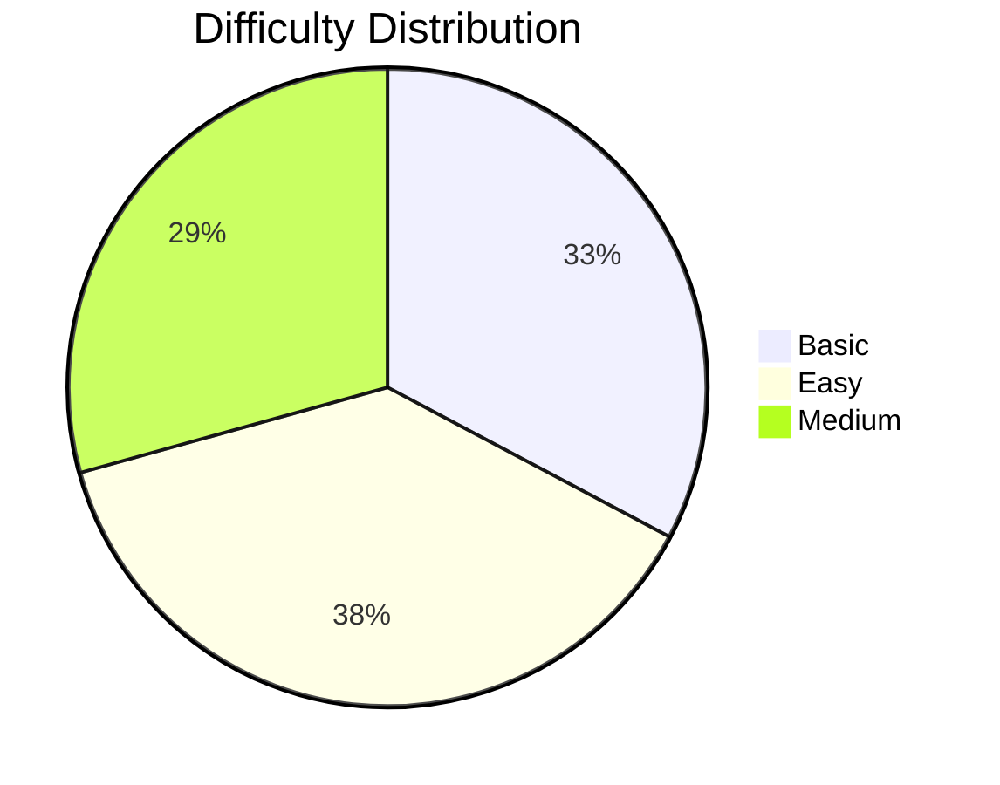

# 📊 1-Math_GFG - GeeksforGeeks Progress Tracker

---

## 📑 Table of Contents

1. [📈 Progress Statistics](#-progress-statistics)
2. [🏷️ Top Topics by Question Frequency](#️-top-topics-by-question-frequency)
3. [🏢 Companies](#-companies)
4. [📋 Problems List](#-problems-list)

## 📈 Progress Statistics

| Difficulty    | Total | Solved | Remaining | Progress                                                                          |
| ------------- | ----- | ------ | --------- | --------------------------------------------------------------------------------- |
| ⚪ **Basic**  | `19`  | `0`    | `19`      |  |
| 🟢 **Easy**   | `22`  | `0`    | `22`      |  |
| 🟡 **Medium** | `17`  | `0`    | `17`      |  |

## 🏷️ Top Topics by Question Frequency

| Rank | Topic                   | Questions | Percentage |
| ---- | ----------------------- | --------- | ---------- |
| 1    | **Algorithms**          | `47`      | `81.0%`    |
| 2    | **Mathematical**        | `45`      | `77.6%`    |
| 3    | **Data Structures**     | `10`      | `17.2%`    |
| 4    | **number-theory**       | `5`       | `8.6%`     |
| 5    | **Dynamic Programming** | `4`       | `6.9%`     |
| 6    | **Bit Magic**           | `3`       | `5.2%`     |
| 7    | **Prime Number**        | `3`       | `5.2%`     |
| 8    | **permutation**         | `3`       | `5.2%`     |
| 9    | **Recursion**           | `3`       | `5.2%`     |
| 10   | **sieve**               | `3`       | `5.2%`     |
| 11   | **Matrix**              | `2`       | `3.4%`     |
| 12   | **Geometric**           | `2`       | `3.4%`     |
| 13   | **Searching**           | `2`       | `3.4%`     |
| 14   | **Binary Search**       | `2`       | `3.4%`     |
| 15   | **Arrays**              | `2`       | `3.4%`     |

## 🏢 Companies

| Rank | Company          | Questions | Percentage |
| ---- | ---------------- | --------- | ---------- |
| 1    | **Microsoft**    | `11`      | `19.0%`    |
| 2    | **Amazon**       | `10`      | `17.2%`    |
| 3    | **MAQ Software** | `5`       | `8.6%`     |
| 4    | **Adobe**        | `5`       | `8.6%`     |
| 5    | **Samsung**      | `4`       | `6.9%`     |
| 6    | **VMWare**       | `4`       | `6.9%`     |
| 7    | **Flipkart**     | `4`       | `6.9%`     |
| 8    | **SAP Labs**     | `3`       | `5.2%`     |
| 9    | **Zoho**         | `3`       | `5.2%`     |
| 10   | **Snapdeal**     | `3`       | `5.2%`     |

## 📋 Problems List

- [Series AP](../Problems/1-Math/GFG/Basic/703967_Series_AP.md)
- [The dice problem](../Problems/1-Math/GFG/Basic/704133_The_dice_problem.md)
- [Closest Number](../Problems/1-Math/GFG/Basic/703961_Closest_Number.md)
- [Swap two numbers](../Problems/1-Math/GFG/Basic/704620_Swap_two_numbers.md)
- [Sum of Squares of First n Natural Numbers](../Problems/1-Math/GFG/Easy/887939_Sum_of_Squares_of_First_n_Natural_Numbers.md)
- [Sum of Natural Numbers](../Problems/1-Math/GFG/Basic/702732_Sum_of_Natural_Numbers.md)
- [Multiplication Table](../Problems/1-Math/GFG/Basic/704112_Multiplication_Table.md)
- [Odd or Even](../Problems/1-Math/GFG/Basic/703724_Odd_or_Even.md)
- [Squares in a Matrix](../Problems/1-Math/GFG/Basic/705080_Squares_in_a_Matrix.md)
- [Sum Of Digits](../Problems/1-Math/GFG/Easy/703905_Sum_Of_Digits.md)
- [Reverse digits](../Problems/1-Math/GFG/Basic/703932_Reverse_digits.md)
- [Prime Number](../Problems/1-Math/GFG/Easy/703954_Prime_Number.md)
- [Check for Power](../Problems/1-Math/GFG/Basic/703757_Check_for_Power.md)
- [Distance between 2 points](../Problems/1-Math/GFG/Basic/703978_Distance_between_2_points.md)
- [Valid Triangle](../Problems/1-Math/GFG/Easy/888023_Valid_Triangle.md)
- [Overlapping rectangles](../Problems/1-Math/GFG/Easy/705474_Overlapping_rectangles.md)
- [Factorial](../Problems/1-Math/GFG/Basic/703913_Factorial.md)
- [Pair cube count](../Problems/1-Math/GFG/Easy/704497_Pair_cube_count.md)
- [GCD of two numbers](../Problems/1-Math/GFG/Basic/703672_GCD_of_two_numbers.md)
- [LCM of two numbers](../Problems/1-Math/GFG/Easy/897662_LCM_of_two_numbers.md)
- [Perfect Numbers](../Problems/1-Math/GFG/Easy/704477_Perfect_Numbers.md)
- [Add two fractions](../Problems/1-Math/GFG/Basic/700259_Add_two_fractions.md)
- [Day of the week](../Problems/1-Math/GFG/Easy/704549_Day_of_the_week.md)
- [Nth Fibonacci Number](../Problems/1-Math/GFG/Easy/703841_Nth_Fibonacci_Number.md)
- [Decimal to binary](../Problems/1-Math/GFG/Easy/701111_Decimal_to_binary.md)
- [Find n-th term of series 1, 3, 6, 10, 15, 21](../Problems/1-Math/GFG/Basic/703884_Find_n-th_term_of_series_1,_3,_6,_10,_15,_21.md)
- [Armstrong Numbers](../Problems/1-Math/GFG/Easy/703783_Armstrong_Numbers.md)
- [Palindrome](../Problems/1-Math/GFG/Easy/703915_Palindrome.md)
- [Repeated sum of digits](../Problems/1-Math/GFG/Basic/704424_Repeated_sum_of_digits.md)
- [Count Digits](../Problems/1-Math/GFG/Easy/705530_Count_Digits.md)
- [Nearest Perfect Square](../Problems/1-Math/GFG/Easy/704434_Nearest_Perfect_Square.md)
- [Maximum number of 2X2 squares](../Problems/1-Math/GFG/Easy/706369_Maximum_number_of_2X2_squares.md)
- [Squares in N\*N Chessboard](../Problems/1-Math/GFG/Easy/704775_Squares_in__NN_Chessboard.md)
- [Square Root](../Problems/1-Math/GFG/Easy/700226_Square_Root.md)
- [3 Divisors](../Problems/1-Math/GFG/Medium/703970_3_Divisors.md)
- [Check if divisible by 4](../Problems/1-Math/GFG/Basic/702929_Check_if_divisible_by_4.md)
- [Divisible by 13](../Problems/1-Math/GFG/Medium/897411_Divisible_by_13.md)
- [Print the Kth Digit](../Problems/1-Math/GFG/Basic/704564_Print_the_Kth_Digit.md)
- [Fraction to Repeating Decimal](../Problems/1-Math/GFG/Medium/705108_Fraction_to_Repeating_Decimal.md)
- [nPr](../Problems/1-Math/GFG/Basic/705035_nPr.md)
- [nCr](../Problems/1-Math/GFG/Medium/704542_nCr.md)
- [Pascal Triangle](../Problems/1-Math/GFG/Medium/702695_Pascal_Triangle.md)
- [All divisors of a Number](../Problems/1-Math/GFG/Easy/712172_All_divisors_of_a_Number.md)
- [Prime Factors](../Problems/1-Math/GFG/Easy/705041_Prime_Factors.md)
- [Largest prime factor](../Problems/1-Math/GFG/Medium/703958_Largest_prime_factor.md)
- [Modular Exponentiation](../Problems/1-Math/GFG/Medium/703909_Modular_Exponentiation.md)
- [Nth Catalan Number](../Problems/1-Math/GFG/Medium/701751_Nth_Catalan_Number.md)
- [nCr](../Problems/1-Math/GFG/Medium/704542_nCr.md)
- [Power Set](../Problems/1-Math/GFG/Medium/704428_Power_Set.md)
- [Next Permutation](../Problems/1-Math/GFG/Medium/705146_Next_Permutation.md)
- [Power of k in factorial of n](../Problems/1-Math/GFG/Medium/705234_Power_of_k_in_factorial_of_n.md)
- [Determinant of a Matrix](../Problems/1-Math/GFG/Medium/701269_Determinant_of_a_Matrix.md)
- [Josephus problem](../Problems/1-Math/GFG/Easy/700361_Josephus_problem.md)
- [Euler Totient Function](../Problems/1-Math/GFG/Easy/704399_Euler_Totient_Function.md)
- [Tower Of Hanoi](../Problems/1-Math/GFG/Medium/701190_Tower_Of_Hanoi.md)
- [Angle between hour and minute hand](../Problems/1-Math/GFG/Medium/703981_Angle_between_hour_and_minute_hand.md)
- [Super Primes](../Problems/1-Math/GFG/Medium/702913_Super_Primes.md)
- [Sieve of Eratosthenes](../Problems/1-Math/GFG/Medium/704146_Sieve_of_Eratosthenes.md)

## 📊 Difficulty Distribution

---

_Generated on 17--09--2025 from `1-Math_GFG.json`_

**Happy Coding! 🚀 Learn from Mistakes! 📈 Keep Going! 💪**

